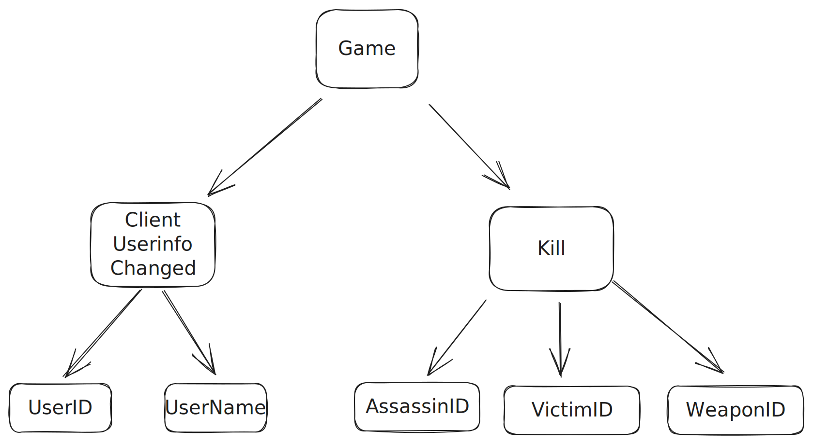

# Quake log parser

This project parses a [Quake log file](./data/quake.log) to gather some information about all the games, its players and kills.

It uses [Ohm](https://ohmjs.org) as the library to build the parser.

[You can check the grammar here](./src/parser/Quake.ohm).

## Dependencies

This depends on `Node.js` (tested with version `20.2`) and `yarn`.

## Setup

Run `yarn install`

## Getting the parsed 'AST'

Run `./src/cli.ts parse` to get a JSON representation of a log file AST.

<details>
<summary>Click here too see an example of how an AST looks like.</summary>
<p>

```json
{
  "kind": "AllGames",
  "children": [
    {
      "kind": "Game",
      "children": [
        {
          "kind": "ClientUserinfoChanged",
          "children": [
            {
              "kind": "UserID",
              "content": "2"
            },
            {
              "kind": "UserName",
              "content": "Dono da Bola"
            }
          ]
        },
        {
          "kind": "ClientUserinfoChanged",
          "children": [
            {
              "kind": "UserID",
              "content": "3"
            },
            {
              "kind": "UserName",
              "content": "Isgalamido"
            }
          ]
        },
        {
          "kind": "ClientUserinfoChanged",
          "children": [
            {
              "kind": "UserID",
              "content": "4"
            },
            {
              "kind": "UserName",
              "content": "Zeh"
            }
          ]
        },
        {
          "kind": "ClientUserinfoChanged",
          "children": [
            {
              "kind": "UserID",
              "content": "5"
            },
            {
              "kind": "UserName",
              "content": "Assasinu Credi"
            }
          ]
        },
        {
          "kind": "Kill",
          "children": [
            {
              "kind": "AssassinID",
              "content": "3"
            },
            {
              "kind": "VictimID",
              "content": "4"
            },
            {
              "kind": "WeaponID",
              "content": "6"
            }
          ]
        },
        {
          "kind": "Kill",
          "children": [
            {
              "kind": "AssassinID",
              "content": "3"
            },
            {
              "kind": "VictimID",
              "content": "2"
            },
            {
              "kind": "WeaponID",
              "content": "7"
            }
          ]
        },
        {
          "kind": "ClientUserinfoChanged",
          "children": [
            {
              "kind": "UserID",
              "content": "2"
            },
            {
              "kind": "UserName",
              "content": "Zeh"
            }
          ]
        },
        {
          "kind": "ClientUserinfoChanged",
          "children": [
            {
              "kind": "UserID",
              "content": "2"
            },
            {
              "kind": "UserName",
              "content": "Zeh"
            }
          ]
        },
        {
          "kind": "Kill",
          "children": [
            {
              "kind": "AssassinID",
              "content": "1022"
            },
            {
              "kind": "VictimID",
              "content": "5"
            },
            {
              "kind": "WeaponID",
              "content": "22"
            }
          ]
        },
        {
          "kind": "Kill",
          "children": [
            {
              "kind": "AssassinID",
              "content": "2"
            },
            {
              "kind": "VictimID",
              "content": "5"
            },
            {
              "kind": "WeaponID",
              "content": "10"
            }
          ]
        },
        {
          "kind": "Kill",
          "children": [
            {
              "kind": "AssassinID",
              "content": "5"
            },
            {
              "kind": "VictimID",
              "content": "5"
            },
            {
              "kind": "WeaponID",
              "content": "7"
            }
          ]
        },
        {
          "kind": "Kill",
          "children": [
            {
              "kind": "AssassinID",
              "content": "1022"
            },
            {
              "kind": "VictimID",
              "content": "5"
            },
            {
              "kind": "WeaponID",
              "content": "22"
            }
          ]
        },
        {
          "kind": "Kill",
          "children": [
            {
              "kind": "AssassinID",
              "content": "5"
            },
            {
              "kind": "VictimID",
              "content": "2"
            },
            {
              "kind": "WeaponID",
              "content": "6"
            }
          ]
        },
        {
          "kind": "Kill",
          "children": [
            {
              "kind": "AssassinID",
              "content": "5"
            },
            {
              "kind": "VictimID",
              "content": "2"
            },
            {
              "kind": "WeaponID",
              "content": "6"
            }
          ]
        },
        {
          "kind": "Kill",
          "children": [
            {
              "kind": "AssassinID",
              "content": "2"
            },
            {
              "kind": "VictimID",
              "content": "5"
            },
            {
              "kind": "WeaponID",
              "content": "7"
            }
          ]
        },
        {
          "kind": "Kill",
          "children": [
            {
              "kind": "AssassinID",
              "content": "1022"
            },
            {
              "kind": "VictimID",
              "content": "5"
            },
            {
              "kind": "WeaponID",
              "content": "22"
            }
          ]
        },
        {
          "kind": "Kill",
          "children": [
            {
              "kind": "AssassinID",
              "content": "5"
            },
            {
              "kind": "VictimID",
              "content": "5"
            },
            {
              "kind": "WeaponID",
              "content": "7"
            }
          ]
        },
        {
          "kind": "Kill",
          "children": [
            {
              "kind": "AssassinID",
              "content": "1022"
            },
            {
              "kind": "VictimID",
              "content": "2"
            },
            {
              "kind": "WeaponID",
              "content": "22"
            }
          ]
        },
        {
          "kind": "Kill",
          "children": [
            {
              "kind": "AssassinID",
              "content": "5"
            },
            {
              "kind": "VictimID",
              "content": "2"
            },
            {
              "kind": "WeaponID",
              "content": "6"
            }
          ]
        },
        {
          "kind": "Kill",
          "children": [
            {
              "kind": "AssassinID",
              "content": "1022"
            },
            {
              "kind": "VictimID",
              "content": "5"
            },
            {
              "kind": "WeaponID",
              "content": "22"
            }
          ]
        }
      ]
    }
  ]
}
```

And here's an image representation:



</p>

</details>

## Getting a report

Run `./src/cli.ts report` to get a JSON report of all games

<details>
<summary>Click here too see an example of how a report looks like.</summary>
<p>

```json
[
  {
    "id": 1,
    "players": [
      {
        "id": "2",
        "name": "Zeh",
        "kills": 1
      },
      {
        "id": "3",
        "name": "Isgalamido",
        "kills": 2
      },
      {
        "id": "4",
        "name": "Zeh",
        "kills": 0
      },
      {
        "id": "5",
        "name": "Assasinu Credi",
        "kills": 1
      }
    ],
    "totalKills": 14,
    "killsByMeans": {
      "MOD_ROCKET": 4,
      "MOD_ROCKET_SPLASH": 4,
      "MOD_TRIGGER_HURT": 5,
      "MOD_RAILGUN": 1
    }
  }
]
```

</p>
</details>